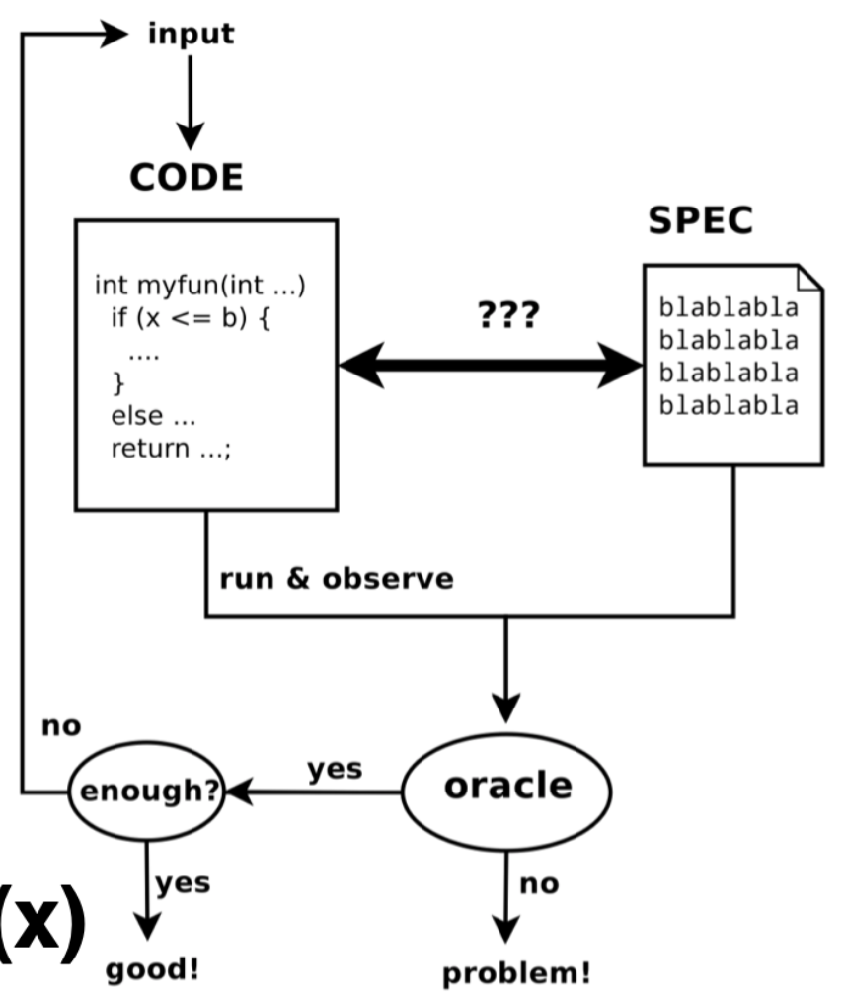

# Modern Software Techniques for Automated Testing (Part 1)

Challenges:
* Non-linear properties: float2int(x) <= INT_MAX
* Trascedental functions
* (0.1 + 0.2) + 0.3 != 0.1 + (0.2 + 0.3)

Objective:
* Making a correct system.

## Random testing
Correctness:
* Specification: how the program should work in our minds.
* Semantics may fall inside the specification or not.
* A program P is correct <=> semantics(P) C= specification(P)

Verification & Static Analysis:
* Verify that semantics are within specification.
* Difficult to describe mathematically whether semantics fall inside or not.
* In practice: verify a overset of semantics: abstract semantics, without running P.
* semantics(P) C= semantics#(P)
* Verify: semantics#(P) C= specification(P)

Testing:
* Execution scenario _e_ of semantics(P) such that _e_ is not in specification(P).

Automated testing techniques:
* Overview of automated testing
* Fuzzing
* Symbolic execution

Automated testing:
1. Specify SPEC. (*)
2. Pick an input _x_. (*)
3. Run the program, getting CODE(x)
4. A bug is detected if CODE(x) fails to comply with SPEC.
5. Determine whether testing should stop. Otherwise go to (2.) again. (*)

(*) is a challenge in research.

 

Specify the SPEC:
* Domain-specific expertise. E.g. robot not touching people.
* This step can hurdle test automation.
* Free SPEC: crashes and code coverage.

Code coverage:
* How much of your code has been tested.
* Branch, path, function coverage.
* 70-80% of code coverage is a reasonable goal.
* Aviation standard DO-178B requires 100%.

Challenges:
* Find an input set that covers all the branches.
* Find an input set that covers all the paths.
* Finding paths is exponential!!! Too much combinations of paths.

Picking input _x_:
* Software develoeprs can craft valid inputs
* They may miss boundary cases.
* Random inputs can be more effective in triggering hidden bugs.
* Random inputs can be unrealistic.

When test should stop?:
* If few bugs are found, program is very good or tests are bad.
* Many bugs are found: tests are very effective.
* In general, it is extremely hard. _Testing is inherently incomplete_.

Symbolic execution:
* Explore all the paths
* Not deeply deployed in the industry
* Expensive
* Use a constraint solver to check whether there are corresponding inputs that crash the program.

Symbolic execution:
* Input _y_ gets a symbolic value _Y_
* Run the program symbolically to get path conditions.
* Solve the path conditions.
* Benefits:
    * Exhaustive
    * Small search space
* Problems:
    * Too many paths: recursion, loops
    * Dealing with non-primitive types
    * Can be too slow to be useful

Sanitizers:
* Related with symbolic execution
* Assert _b_ != 0 in _a_ / _b_ division.

Statistics:
* Can be useful to leverage.
