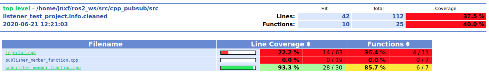

 

 

# Advanced Software Analysis

This repository compiles the different activities that have been carried out during the Advanced Software Analysis course at the IT University of Copenhagen during Fall 2020: mainly class notes and assignments.

## Class notes
###  A. Modern Software Techniques for Testing, Automated Verification, and Program Analysis

_Based on [Prof. Zhoulai Fu's course material](https://github.com/zhoulaifu/20_teaching_asa)._

1. [Modern Software Techniques for Automated Testing](A_software_testing_verification_analysis/01_testing)
2. [Modern Software Techniques for Automated Verification](A_software_testing_verification_analysis/02_verification)
3. [Modern Software Techniques for Program Analysis](A_software_testing_verification_analysis/03_analysis)

### B. Type-Driven Development

* [Week 6](B_type_driven_development/Week_6)
* [Week 7](B_type_driven_development/Week_7)